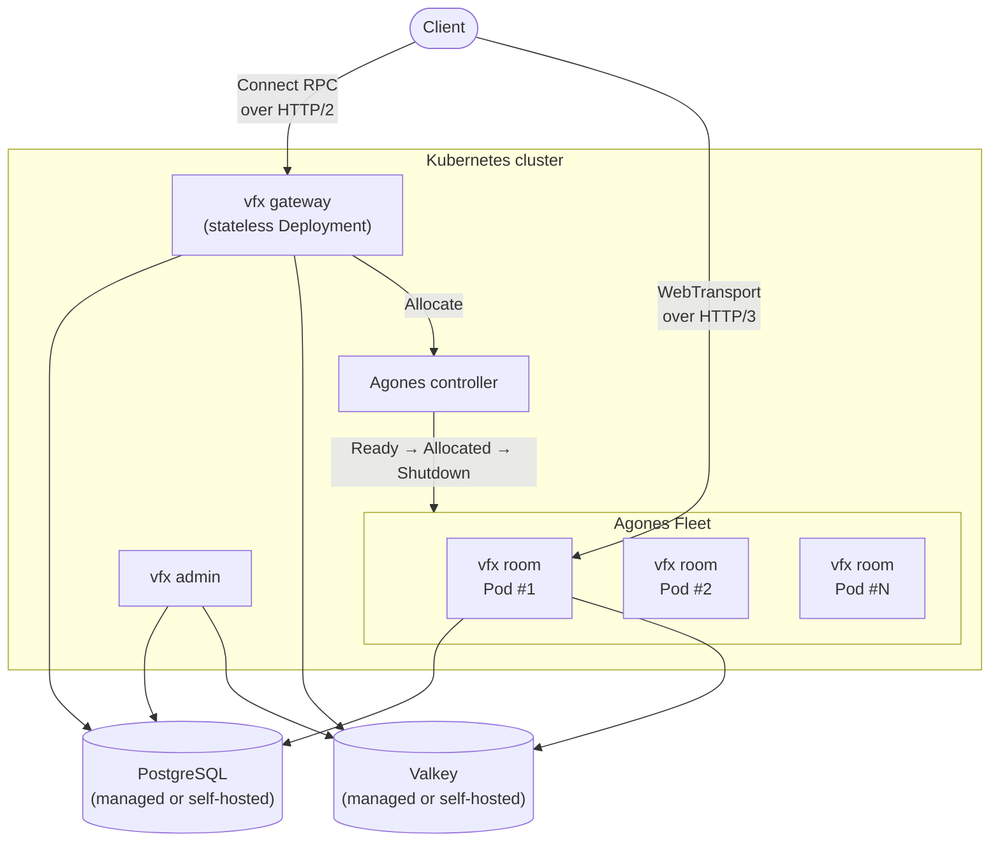
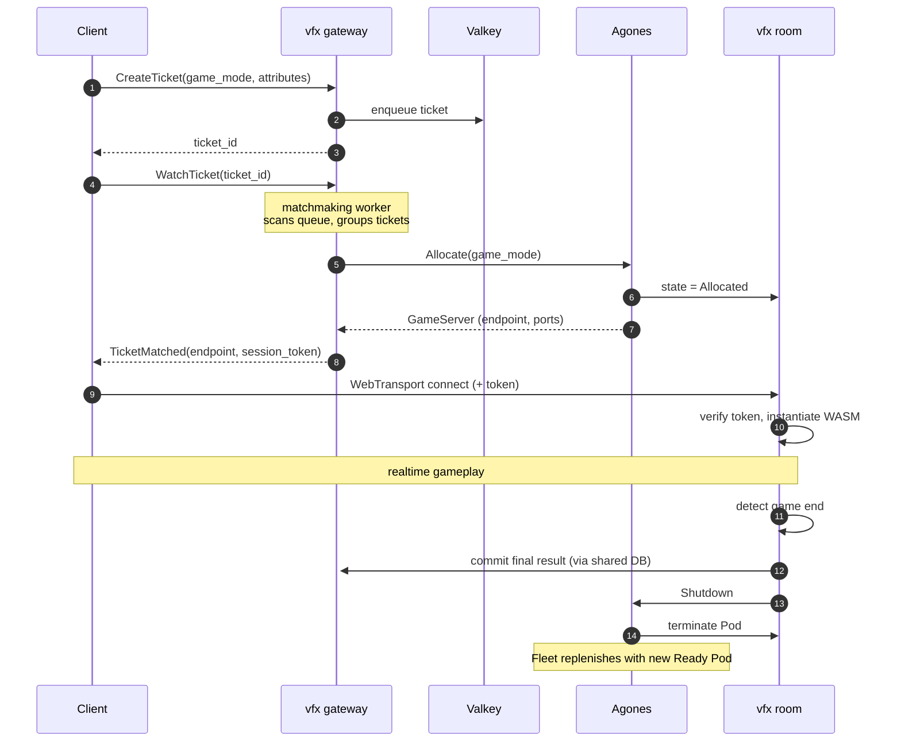
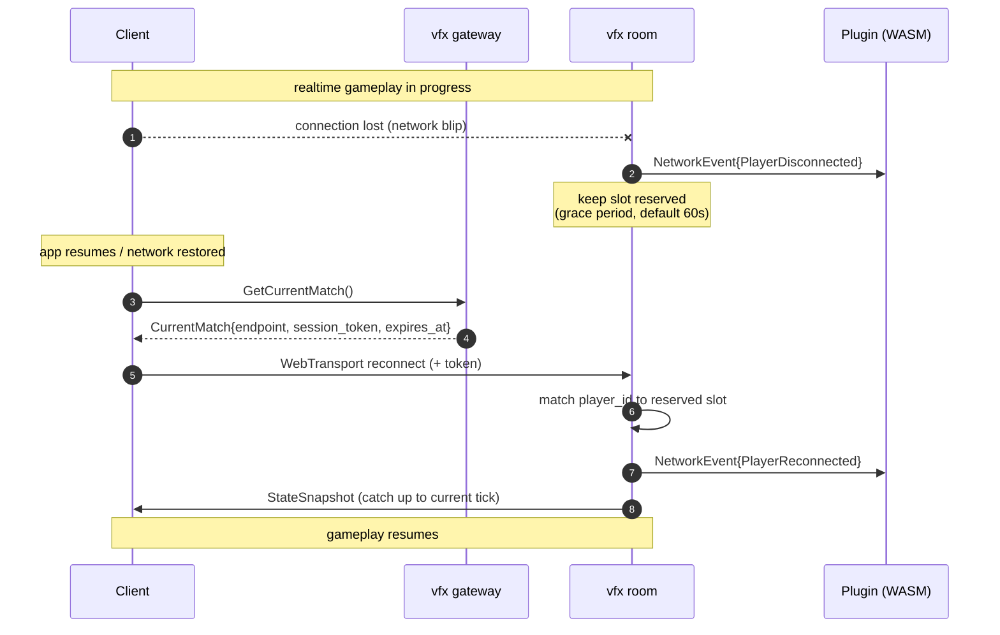
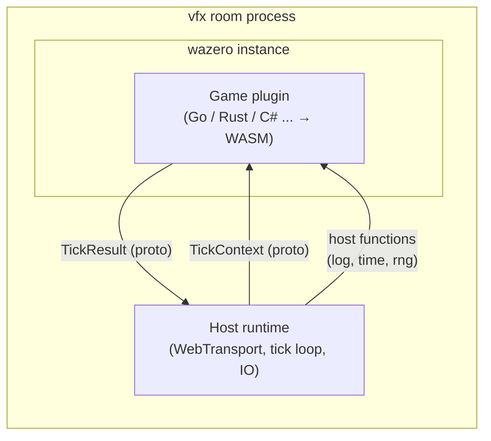
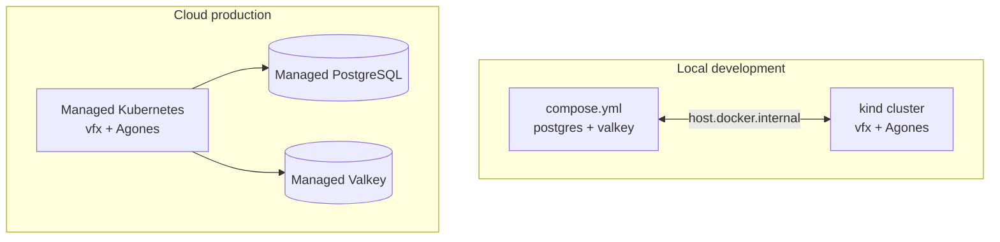

# Architecture

This document captures the system design of vfx: components, protocols, deployment topology, and the rationale behind the major choices.

## Overview

vfx is a game server engine built around three architectural commitments:

1. **WebTransport (HTTP/3) for realtime**, mixing reliable streams and unreliable datagrams in one connection.
2. **WebAssembly for game logic**, isolating user code from the host runtime and allowing any language that targets WASM.
3. **Kubernetes-native operation** with Agones managing the lifecycle of match-hosting processes.

The engine is delivered as a single binary that runs in different roles depending on the subcommand.

## Design Principles

- **One process per match.** Each in-progress match is hosted by exactly one process (an Agones GameServer Pod). Density is managed by running many Pods, not by multiplexing matches within one process.
- **Stateless gateway, stateful room.** The gateway handles auth, matchmaking, and storage APIs and can scale horizontally behind a load balancer. The room process holds in-memory match state and is addressed individually.
- **Schema-first.** Protocol Buffers are the source of truth for both wire protocols and code generation.
- **Standard infrastructure.** vfx integrates with widely used building blocks (PostgreSQL, Valkey, Agones, Kubernetes) rather than inventing its own.
- **Single-tenant.** vfx is intended to be deployed by an operator running their own game(s). It is not a multi-tenant SaaS platform.

## Components



### vfx gateway

- Stateless HTTP server speaking Connect RPC over HTTP/2.
- Surfaces: authentication, matchmaking, storage API, leaderboard, social features, admin RPCs.
- Holds no per-match state; can be scaled horizontally behind any L7 load balancer.
- Runs the matchmaking worker as a goroutine: pulls tickets from Valkey, groups them, and calls the Agones Allocator.

### vfx room

- Hosts exactly one match for its lifetime.
- Listens on UDP for WebTransport (HTTP/3) connections.
- Embeds [`wazero`](https://wazero.io/) and runs the game-specific WASM plugin.
- Integrates the Agones SDK to report `Ready`, `Health`, and `Shutdown`.
- Writes the final match result to PostgreSQL on completion, then exits; Agones replenishes the Fleet.

### vfx admin

- Operational API (and later a web UI) for inspecting rooms, players, and plugin deployments.
- Deployed separately from the gateway, on a different port and behind separate auth.

### vfx migrate

- Wraps `atlas` to apply database migrations.
- Designed to run as a Kubernetes Job during deploy.

## Protocols

### Control plane: Connect RPC over HTTP/2

Connect was chosen for the control plane because:

- It is callable directly from browsers without a translation proxy.
- The same Protocol Buffers definitions generate idiomatic clients in Go, TypeScript, and other languages.
- HTTP semantics make it easy to debug with curl.
- Server-side streaming covers matchmaking notifications cleanly.

### Realtime: WebTransport over HTTP/3

WebTransport provides:

- **Reliable bidirectional streams** for important events (match start, score updates, errors).
- **Unreliable datagrams** for high-frequency state updates that tolerate loss.
- **Connection migration** via QUIC, which improves mobile experience.
- **TLS by default**, removing an entire class of misconfiguration.

A WebSocket fallback path for environments without HTTP/3 support is not currently implemented.

### Message envelope

Every realtime message is wrapped in a single envelope so reliable streams and datagrams share one codec:

```protobuf
message Frame {
  uint64 seq = 1;

  oneof body {
    PlayerInput input = 10;
    StateSnapshot snapshot = 20;
    StateDelta delta = 21;
    SystemEvent event = 22;
    ErrorMessage error = 23;
  }
}
```

The game-specific payload inside `PlayerInput` and `StateDelta` is opaque `bytes`, interpreted by the WASM plugin.

## Schema Management

| Layer | Tool |
| --- | --- |
| API (`.proto`) | [`buf`](https://buf.build/) for lint, breaking-change detection, and code generation. |
| Database schema | [`atlas`](https://atlasgo.io/) with a declarative `schema.sql` driving versioned migrations. |
| SQL queries | [`sqlc`](https://sqlc.dev/) for type-safe Go bindings. |

The repository keeps generated code under `gen/` (gitignored) and `sdk/.../gen/` (gitignored, regenerated by `buf generate`).

Breaking-change detection runs in CI: `buf breaking --against '.git#branch=main'`.

## Match Lifecycle



## Reconnection

Players will lose their connection to the room — Wi-Fi to cellular handoff, app backgrounding, brief network blips, full restarts. The protocol handles each of these without forcing a rematch.



Key design points:

- The room keeps the player's slot reserved for a configurable grace period (default 60s) after a disconnect.
- `MatchService.GetCurrentMatch` returns a fresh short-lived session token if the player is still in a match — the client does not need to remember its old token, only its login.
- The plugin sees three distinct events: `PlayerDisconnected` (transient), `PlayerReconnected` (came back), and `PlayerLeft` (permanently gone). The plugin decides how to handle each — pause the player's actions during disconnect, replay missed events on reconnect, or surrender the slot.
- On reconnect, the room sends a full `StateSnapshot` so the client catches up immediately without replaying every delta.

## Storage

### PostgreSQL

- Sole long-lived storage target.
- Holds accounts, friends, match history, key-value records, leaderboards.
- Managed services (Cloud SQL, RDS, Neon, Supabase) and self-hosted instances are both first-class.
- Distributed SQL backends are not a supported target.

### Valkey

- Ephemeral state: matchmaking queue, ticket subscriptions, room allocation index, leaderboard caches.
- Treated as recoverable: an outage stops new matchmaking but does not corrupt anything persistent.

## Plugin Model

vfx plugins are WebAssembly modules executed by `wazero` inside the room process. The host and the guest communicate through a Protocol Buffers ABI defined in `schema/api/plugin/v1/plugin.proto`.



Design constraints:

- The host calls the plugin once per tick with all queued player actions batched into a single `TickContext`. The plugin returns a single `TickResult` containing state diffs and outbound messages.
- This batching limits FFI cost to two crossings per tick, regardless of input volume.
- Plugins must be deterministic when given the same `TickContext`, including seeded RNG. This enables replays and dispute resolution.

Plugin manifests (capability declarations) are returned from a one-time `Init` call when the room loads a plugin. They are not duplicated in sidecar files.

## Deployment Topology

The same Helm chart is used for every environment. Differences are expressed through values files.

| Environment | Cluster | Database |
| --- | --- | --- |
| Local development | kind | PostgreSQL via `compose.yml` |
| Small production (VPS) | k3s, single node | PostgreSQL in `compose.yml` or managed |
| Cloud production | Managed Kubernetes | Managed PostgreSQL service |



### Why DB outside Kubernetes locally

Running PostgreSQL via `compose.yml` rather than inside the kind cluster:

- Mirrors production where the database is a managed service outside the workload cluster.
- Survives cluster recreation, so iteration on application code does not wipe data.
- Makes direct inspection (`psql`) and debugging straightforward.

## Matchmaking

Matchmaking is implemented inside the gateway as a worker goroutine. It is intentionally a small piece of code rather than a separate dependency.

- Tickets are stored in Valkey, scored by game mode, region, and rating.
- The worker scans the queue at a fixed interval (100ms by default).
- Compatible tickets are grouped according to a `MatchingPolicy` that defines tier-based relaxation: after N seconds of waiting, the rating spread and region constraints loosen.
- On success the worker calls the Agones Allocator, signs a short-lived session token, and notifies the players through their `WatchTicket` server stream.

This design keeps matchmaking visible and tunable in regular Go code. A pluggable interface is kept open so that a heavier matchmaking system can be substituted in the future without changing the public API.

## Testing Strategy

Three layers, with different speed and infrastructure requirements.

| Layer | Scope | Speed | Infrastructure |
| --- | --- | --- | --- |
| Unit | Pure functions, domain types | ~1ms per test | `go test` |
| Component | Connect RPC handlers, repositories | ~100ms per test | `testcontainers` for PostgreSQL and Valkey |
| End-to-end | gateway + room + Agones | seconds per test | kind cluster with Agones installed |

Tests are written in standard Go style: table-driven cases with `testing` and `testify`. No BDD framework is required.

Shared test utilities live under `internal/testutils/`:

- `testconnect` — boots an in-process Connect RPC server with the production wiring.
- `testwt` — boots a WebTransport server for room handler tests.
- `testagones` — fake Agones SDK for unit tests; the real SDK is used in E2E.
- `testwasm` — loads a WASM plugin in isolation for plugin-author testing.
- `fixture` — declarative test data builders.
- `faker` — deterministic IDs (`UUIDv5("name")`) for stable assertions.

## Observability

- All processes export OpenTelemetry traces and metrics.
- W3C Trace Context propagates from the client through the gateway and into the room.
- Per-room metrics include tick duration, FFI call count, player count, and WASM memory usage.
- Health and readiness probes are implemented for every workload.

## Non-Goals

- **MMO-style persistent worlds.** vfx hosts discrete matches, not zones with thousands of co-located players.
- **Multi-tenant SaaS.** vfx is meant to be deployed by an operator running their own games.
- **Distributed SQL.** Supporting multiple SQL dialects is a constant tax that conflicts with the goal of staying small. PostgreSQL is the only target.
- **Built-in match-function plugin system (separate from game logic).** Matchmaking lives in vfx code, configurable but not pluggable in the way game logic is.
